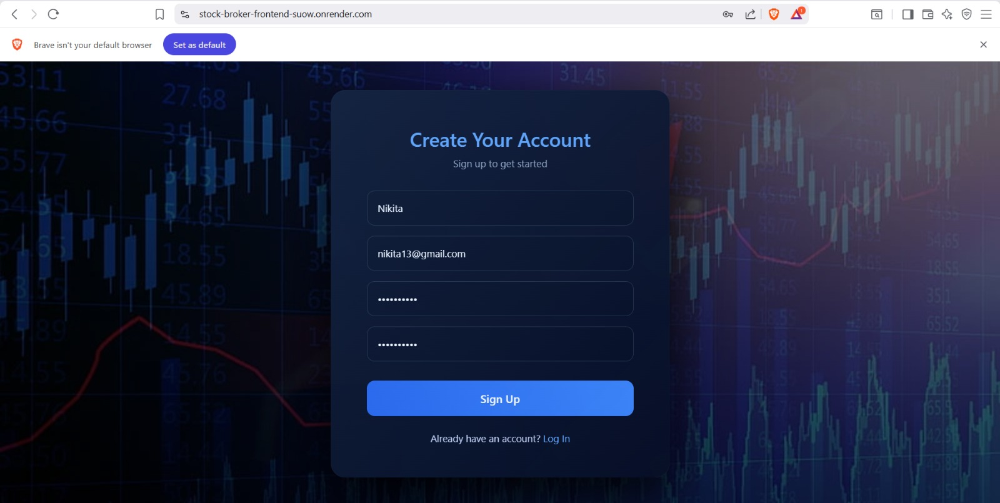
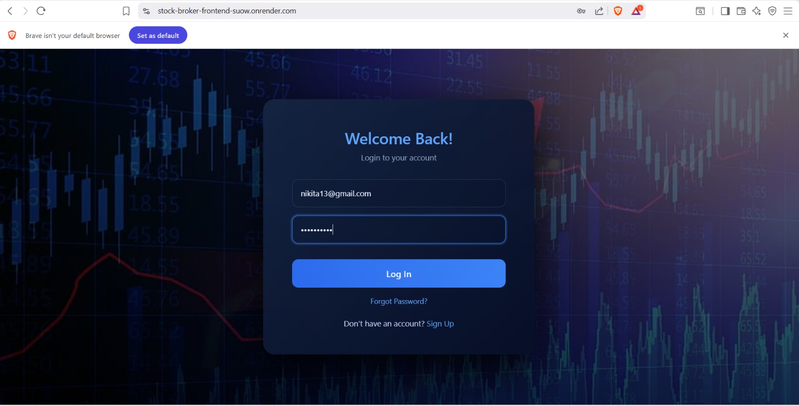
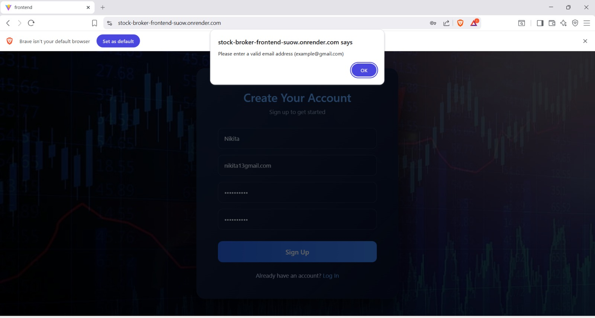
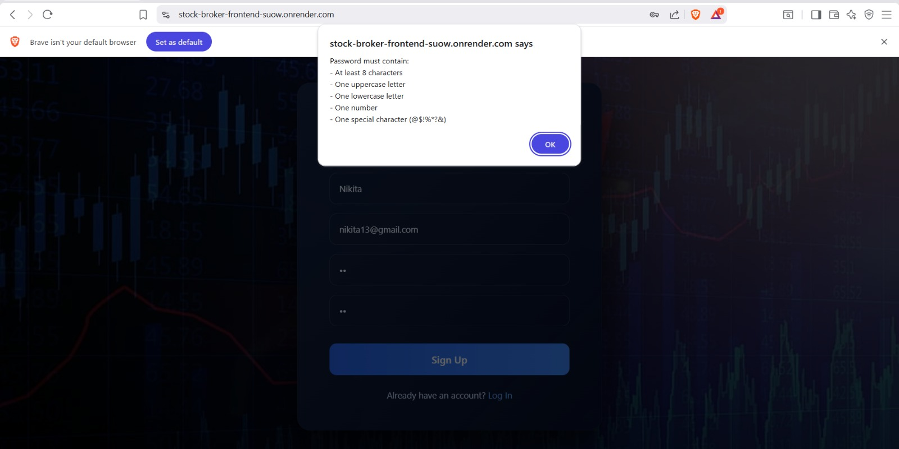
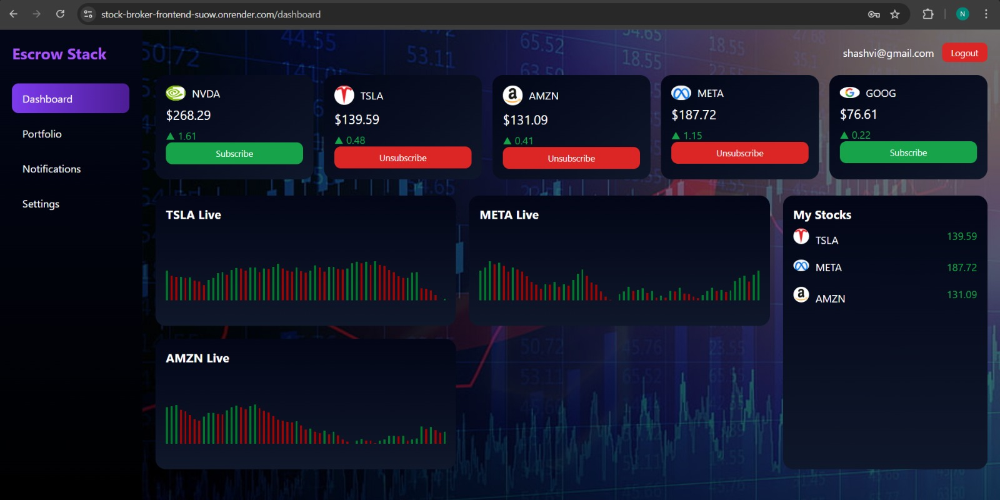
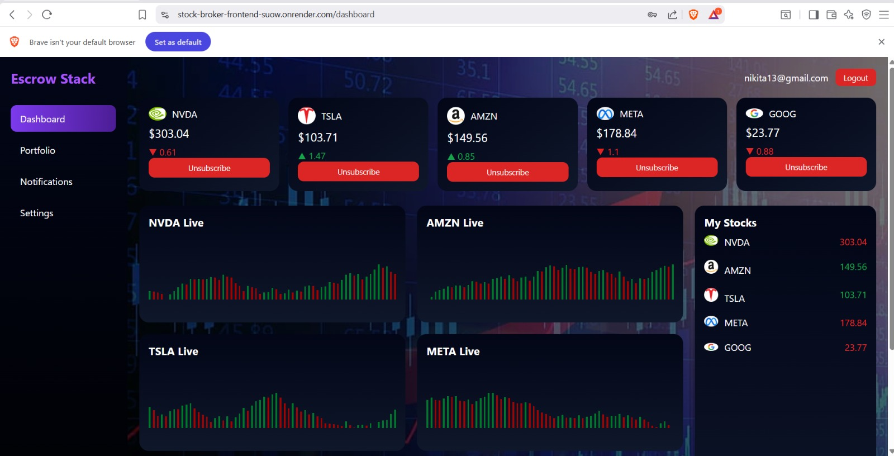

# 📈 Stock Broker Client Dashboard

A real-time stock broker client web application that allows multiple users to log in, subscribe to stocks, and receive live stock price updates without refreshing the page.  
This project demonstrates **authentication, real-time communication, and user-specific dashboards** using **React, Node.js, Express, and Socket.IO**.

---

## 🚀 Project Overview

The Stock Broker Dashboard enables users to:
- Log in using their email credentials
- Subscribe or unsubscribe from supported stocks
- View live stock price updates in real time
- Maintain separate dashboards for multiple users simultaneously
- Observe asynchronous updates across different user sessions

The application uses  separate **frontend** and **backend** folders.

---

## 📄 Application Pages & Rules

### 🔐 Authentication Page (Auth.jsx)

The authentication page serves as the entry point for all users.  
It supports **both Login and Signup** using a single interface.

**Rules & Validations applied:**
- Email must follow a valid email format (example@gmail.com)
- Password must contain:
  - Minimum 8 characters
  - At least one uppercase letter
  - At least one lowercase letter
  - One number
  - One special character
- Signup requires password and confirm password to match
- Login is allowed only if credentials exist in the backend
- On successful login:
  - User email is stored in `localStorage`
  - User is redirected to the Dashboard
- On logout:
  - Local storage is cleared
  - User is redirected back to Auth page

**Backend APIs used:**
- `POST /api/signup`
- `POST /api/login`

---

### 📊 Dashboard Page (Dashboard.jsx)

The dashboard is a **user-specific, real-time stock monitoring interface**.

**Key functionalities:**
- Displays available stocks (NVDA, TSLA, AMZN, META, GOOG)
- Shows live stock prices updated every second
- Allows users to:
  - Subscribe to stocks
  - Unsubscribe from stocks
- Displays:
  - Price change indicators (up/down)
  - Subscribed stocks list under “My Stocks”
- Each user has **independent subscriptions**
- Prices update in real time without page refresh

**Real-time features:**
- Uses **Socket.IO** to receive live stock price updates
- Prices are broadcasted from backend to all connected clients
- Each dashboard updates asynchronously

**Backend APIs used:**
- `GET /api/subscriptions/:email`
- `POST /api/subscribe`
- Socket event: `stockUpdate`

---

## 🧠 Backend Logic Overview

The backend is built using **Node.js + Express + Socket.IO**.

**Core responsibilities:**
- Handle user authentication (signup & login)
- Maintain in-memory user data and subscriptions
- Generate random stock price fluctuations every second
- Broadcast live price updates to all connected clients
- Serve user-specific subscription data

**Important Note:**
- Data is stored in-memory (no database)
- Suitable for learning, demos, and real-time system understanding

---

## ☁️ Deployment Details (Render)

The application is deployed using **Render**.

### Backend Deployment
- Deployed as a **Web Service**
- Environment: Node.js
- Automatically assigns a public backend URL
- Handles:
  - REST APIs
  - Socket.IO connections
  - Live stock price broadcasting

### Frontend Deployment
- Deployed as a **Static Site**
- Built using **Vite**
- Communicates with backend using the Render backend URL
- Fully functional real-time UI hosted publicly

---

## 📷 Output Screenshots

The following outputs are included for reference:
- Authentication page (Login & Signup)
- Dashboard view for logged-in users
- Real-time stock price updates
- Multiple users logged in simultaneously
- Independent stock subscriptions per user

(Screenshots will be attached below this section)
## 📷 Application Screenshots

### 📝 User Signup
Shows the new user registration screen with validations.

---

### 🔐 User Login
Login page where existing users authenticate.

---

### ✅ Email Validation
Displays email format validation during authentication.

---

### 🔑 Password Validation
Shows password rule enforcement during signup/login.

---

### 📊 Dashboard (Chrome Browser)
Main dashboard displaying live stock prices and subscriptions in Chrome.

---

### 📊 Dashboard (Brave Browser)
Same dashboard accessed from a different browser, proving multi-user real-time updates.

---

## 🛠️ Technologies Used

- **Frontend:** React, Vite, CSS
- **Backend:** Node.js, Express
- **Real-time Communication:** Socket.IO
- **Deployment:** Render
- **Version Control:** Git & GitHub

---

## ✅ Key Learning Outcomes

- Implemented authentication flow in React
- Built real-time applications using Socket.IO
- Managed user-specific state across sessions
- Deployed full-stack application to the cloud
- Understood client-server communication in live systems

---
